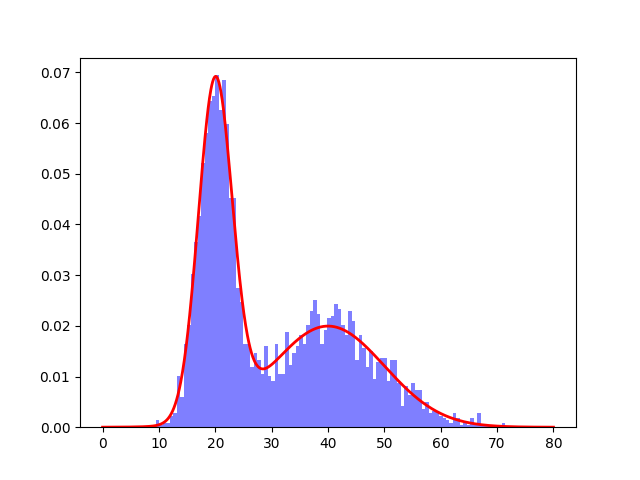

## Reinforcement Learning for Optimal Blackjack Strategy

### Overview

This project aims to implement a reinforcement learning (RL) algorithm to learn the optimal strategy for playing blackjack. Blackjack, also known as 21, is a popular card game where players aim to beat the dealer by having a hand value closer to 21 without exceeding it.

The project utilizes RL techniques, specifically Q-learning, to train an agent to make decisions in the game of blackjack. The agent learns from experience through interactions with the environment, gradually improving its strategy over time.

### Requirements

- Python 3.11
- NumPy
- Matplotlib (for visualization)
- OpenAI Gym (for the blackjack environment)

### Project Structure

- `blackjack.py`: Main script for training the RL agent using Q-learning.
- `blackjack_optimal_strategy.py`: Script to get performance of optimal blackjack strategy.
- `performance.py`: Script to compare the RL agents performance over training to optimal strategy.
- `learnt_grid.py`: Creates visualisation of learnt strategy.
- `optimal_strategy_grid.py`: Creates visualisation of optimal strategy.

### Results

The Q-table values are updated using the Q-learning formula:
`Q(s, a) = (1 - α) * Q(s, a) + α * (r + γ * maxₐ' Q(s', a'))`
- Q(s, a) - the Q-value of state s and action a.
- α - the learning rate (0 < α ≤ 1), controlling the weight given to new information compared to past Q-values.
- r - the immediate reward obtained after taking action a in state s.
- γ - the discount factor (0 ≤ γ < 1), determining the importance of future rewards.
- s' - the next state after taking action a in state s.
- maxₐ' Q(s', a') - the maximum Q-value of all possible actions in state s', estimating the future cumulative reward.

The trained agent's performance is evaluated against the optimal strategy using its win percentage. The visualisation also shows agent's learning progress over episodes. As can be seen below, the agent's strategy becomes comparable to optimal after around 20,000 episodes. A learning rate is initially 0.4 and the exploration rate is initially 0.9, reduced by a factor of 0.95 and 0.85 respectively every 500 episodes.

The agent's strategy can be visualised as a grid with dealer card and player total as the axis, for the situation when the player has and doesn't have a usable ace. The optimal strategy is shown on the left and the agent's learnt strategy is on the right.  By the end of the training,
the agent’s policy looks similar to this optimal strategy, differing mainly on fringe cases which would not have a major impact on the agent’s overall win rate. For example, the agent will choose to hit if the player total is 12 and the dealer is showing a 4, whilst the optimal strategy would suggest standing. The expected value of hitting in this scenario is −0.211161 whilst the expected value of standing is −0.211100. Since the expected values are so close the agent would need many more episodes and a much smaller learning rate before it would correctly decide to stand.

| Optimal Strategy | Learnt Strategy |
|--------------|-------------|
|  |  |

## Distribution Sampling

### Overview

This repository contains Python implementations of the Metropolis-Hastings and rejection sampling algorithms. Metropolis-Hastings is a Markov chain Monte Carlo (MCMC) method commonly used for sampling from complex probability distributions. Rejection sampling is a simple and widely used method for generating samples from a target probability distribution

### Project Structure
`metropolis_hastings_sampling.py`: Implementation of the Metropolis-Hastings algorithm.
`rejection_sampling.py`: Implementation of the rejection sampling algorithm.

### Results

Target distribution: `0.5×Norm(x;μ1=20,σ1=3)+0.5×Norm(x;μ2=40,σ2=10)`  
As shown below, both rejection and Metropolis-Hastings are able to effectively sample from the underlying distribution. However, in 20,000 samples, rejection sampling only obtains 3629 valid samples, an acceptance rate of only 18%. Metropolis-Hastings algorithm guarantees a valid sample for every attempted sample.
| Rejection Sampling | Metropolis-Hastings Sampling |
|--------------|-------------|
|  |  |